# CUDA Accelerated Ray Tracer

A CUDA implementation of the **_Ray Tracing in One Weekend_** Book Series with per-pixel RNG, thin-lens depth of field, metal/dielectric materials, procedural textures, <br>
quads, instancing, light sources, Cornell box, texture mapping, and the randomized final scene. The code mirrors the books’ progression, adapted for GPU kernels and<br>
CUDA memory/launch patterns.

<p align="left">
  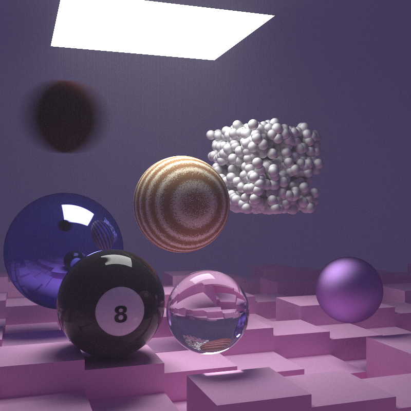
</p>

> References  
> • Peter Shirley, _Ray Tracing in One Weekend_ Book Series — https://raytracing.github.io/  
> • NVIDIA Developer Blog, “Accelerated Ray Tracing in One Weekend in CUDA” — https://developer.nvidia.com/blog/accelerated-ray-tracing-cuda/

---

## Features

### Rendering pipeline
- **Antialiasing via stochastic supersampling** (per-pixel jitter using cuRAND)  
  <p align="left">
    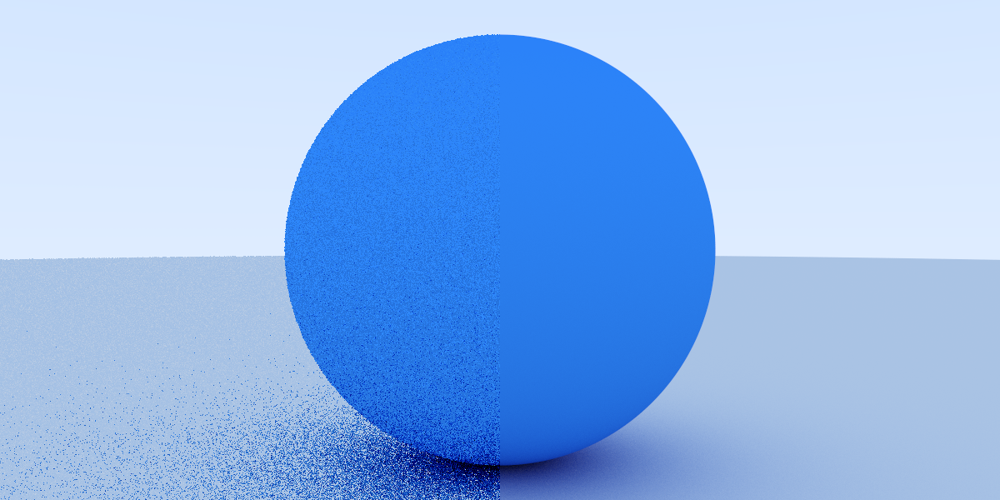
  </p>

- **Gamma correction** with configurable values
  <p align="left">
    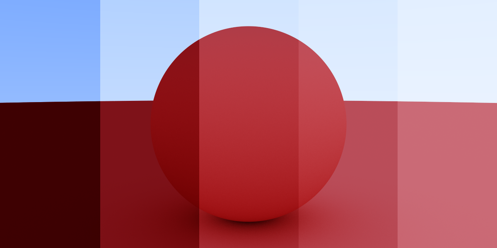
  </p>

### Materials
- **Metal** with **fuzz** parameter for rough/microfacet reflections  
- **Lambertian** (diffuse) with random cosine-ish scattering  
- **Dielectric** (glass): **refraction**, **total internal reflection**, and **Schlick** reflectance  
  <p align="left">
    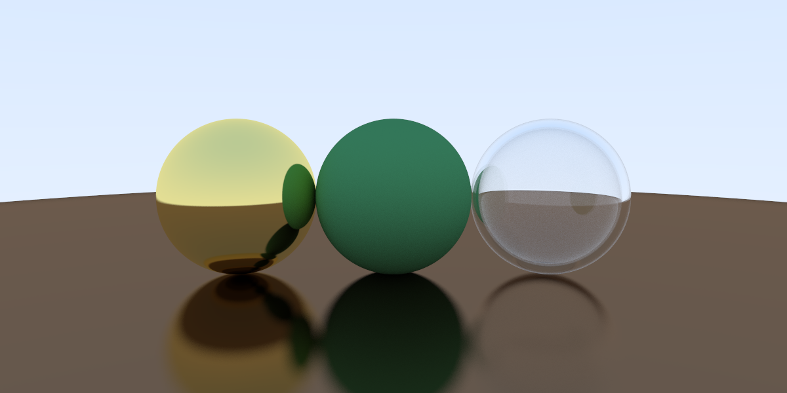
  </p>

### Camera
- **Thin-lens defocus blur (depth of field)** (aperture + focus distance)
- Proper **camera basis** (`u/v/w`) with configurable FOV and aspect ratio
  <p align="left">
      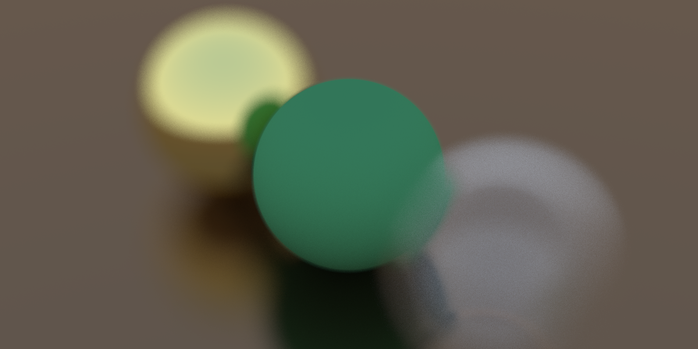
  </p>

### Procedural Textures
- **Checkered planes and spheres**
- **Perlin noise textures** with turbulence & marble patterns  
<p align="left">
  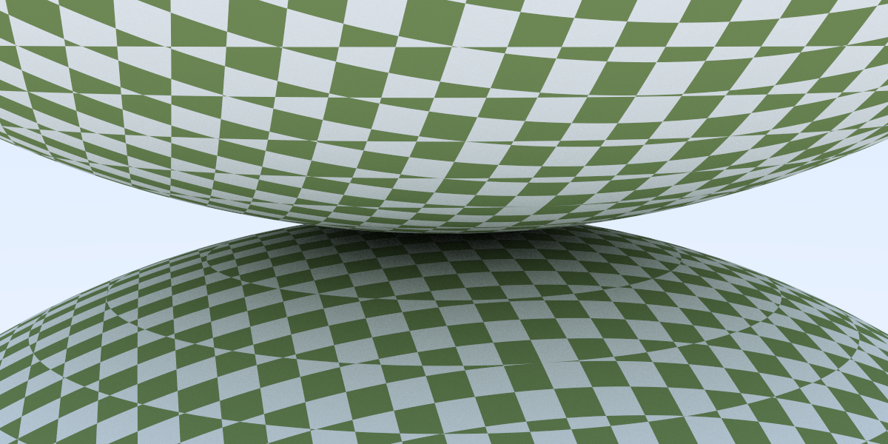
  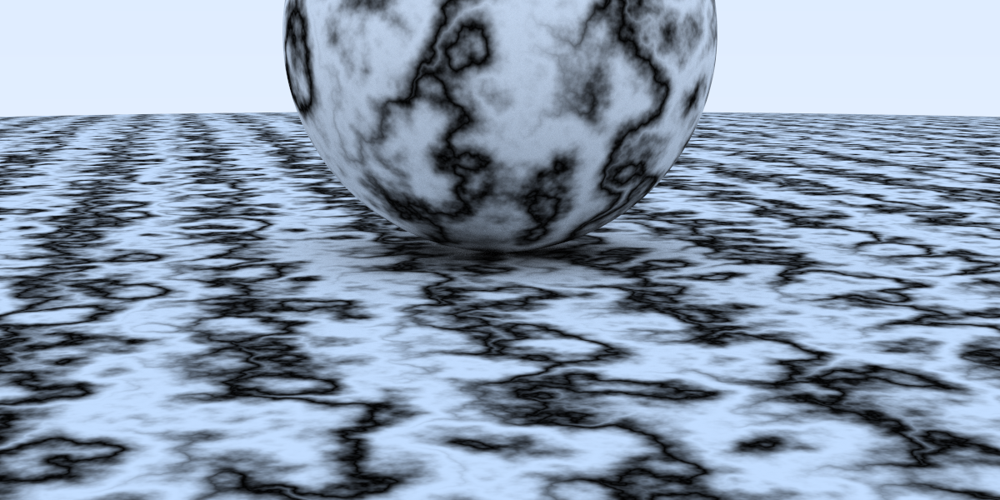
</p>

### Motion Blur
- **Shutter interval sampling**: each ray carries a randomized time in `[time0, time1]`
- **Animated primitives**: object positions are interpolated across the shutter window
- Produces natural blur trails when geometry moves during exposure
<p align="left">
    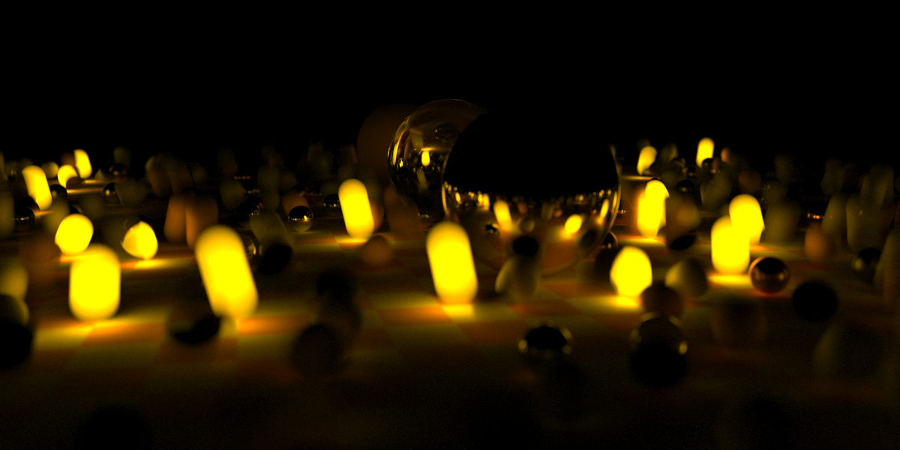
</p>

### Light Sources
- **Emissive materials** for area lights
- Example: Cornell box ceiling quad + glowing sphere  
<p align="left">
  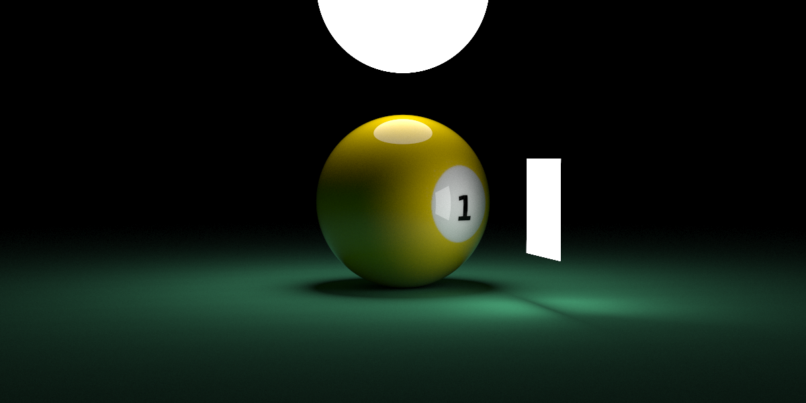
</p>

### Quads & Rectangular Geometry
- General **quad primitive**
- Used for walls, floors, ceilings, and light sources  
<p align="left">
  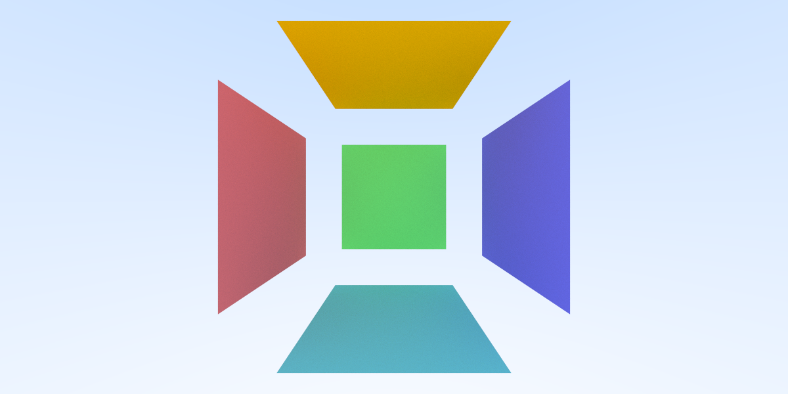
</p>

### Instancing & Object Transforms
- Translate / rotate geometry without duplicating vertex data
- Used to place rotated blocks in the Cornell Box  
<p align="left">
  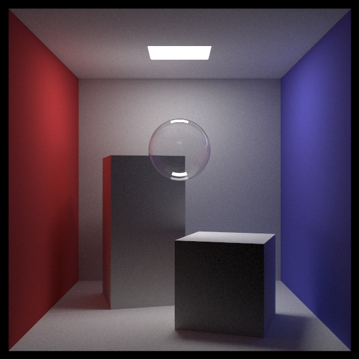
</p>

### Texture Mapping
- Spherical coordinate texture mapping
- Example: Earth texture on a sphere  
<p align="left">
  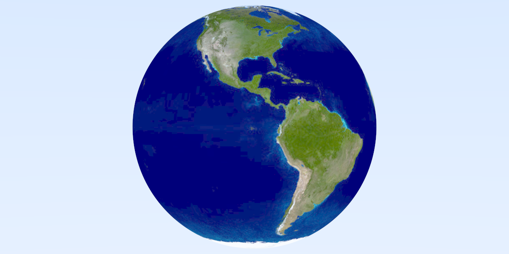
</p>

---

## Requirements

- **Windows** with **Visual Studio 2022** (MSVC toolset)
- **CUDA Toolkit 12+** (13.x tested)
- **CMake 3.25+**
- **Python 3** (optional — for the golden-image test and the PPM tools)
- Any NVIDIA GPU supported by your CUDA toolkit

`CMAKE_CUDA_ARCHITECTURES` defaults to `native`, so nvcc targets the GPU it
finds at configure time. For a portable fat binary, override it:
`cmake -S . -B build -DRT_CUDA_ARCH="75;86;89;120"`.

---

## Build & Run

### Quick start (Windows)

Configures, builds **Release**, runs the tests, then prompts for a scene and an
output name:

```bat
setup.bat
```

### Manual CMake build

```bat
cmake -S . -B build
cmake --build build --config Release --parallel
ctest --test-dir build -C Release --output-on-failure
```

> Build **Release**. A Debug CUDA build compiles device code with `-G`, which
> disables almost all device-side optimisation — useful under `cuda-gdb`, never
> for timing.

### Running

```bat
build\bin\Release\rayTracer.exe --list
build\bin\Release\rayTracer.exe --scene cornell --out cornell.ppm
build\bin\Release\rayTracer.exe --scene original --width 400 --height 400 --spp 500 --out preview.ppm
```

| flag | meaning |
|---|---|
| `--scene NAME` | which scene to render (`--list` to see them) |
| `--width N` `--height N` | override the scene's default resolution |
| `--spp N` | samples per pixel |
| `--max-depth N` | maximum ray bounces (default 50) |
| `--gamma F` | gamma exponent (default 2.2) |
| `--seed N` | RNG seed — same seed + same params gives a bit-identical image |
| `--block X Y` | thread-block dimensions (default `8 8`) |
| `--batch N` | samples per kernel launch (default 64, `0` = all at once) |
| `--out FILE` | write here instead of stdout |
| `--stats FILE` | write timing JSON (`build_ms`, `render_ms`, …) |
| `--ascii` | emit P3 text PPM instead of P6 binary |
| `--quiet` | suppress the progress line |

The renderer writes **binary PPM (P6)** by default; `--ascii` gives the P3 text
form the book uses. Progress and timing go to `stderr`, so `rayTracer.exe
--scene cornell > out.ppm` still works.

`--batch` exists because Windows kills any kernel that runs longer than the
display watchdog timeout (TDR, 2 s by default). Issuing the sample budget as
several short launches is mathematically identical to one long one — the RNG
state carries across launches — and it gives a progress indicator for free.

### Viewing the output

```bat
python tools\ppm_to_png.py output.ppm              REM no dependencies
python tools\ppm_to_png.py output.ppm --scale 4    REM nearest-neighbour zoom
```

or open the `.ppm` directly in GIMP, or `magick convert output.ppm output.png`.

---

## Testing & benchmarking

```bat
ctest --test-dir build -C Release --output-on-failure    REM unit + golden image
python bench\run_bench.py --config bench\targets.json    REM timing matrix
```

See [tests/README.md](tests/README.md) and [bench/README.md](bench/README.md).

---

## How it works (GPU notes)

- **Bounded depth instead of recursion**: the book’s recursive `color()` is turned into a loop (default max depth = 50) to avoid device stack overflows.
- **Per-pixel RNG**: Each thread has a `curandState`. We copy the state to a local variable, sample multiple times, then write it back.
- **Unified memory for the framebuffer** (`cudaMallocManaged`) to simplify host readout (`stdout` → PPM).
- **Device-side scene build**: A small kernel constructs the world and camera once, then the main render kernel traces rays.
- **Thin-lens DOF**: `random_in_unit_disk` samples the aperture; `lower_left_corner`, `horizontal`, and `vertical` are scaled by the **focus distance**; `lens_radius = aperture/2`.

---

## Tuning

- **Samples per pixel** (`--spp`): higher → cleaner images, time ∝ spp.
- **Resolution** (`--width`/`--height`): increase for detail.
- **Max depth** (`--max-depth`): 50 is a good default; raising it gives diminishing returns.
- **Aperture**: small (`0.1`) = subtle blur; large (`2.0`) = strong DOF (needs more spp). Per-scene, in `src/main.cu`.
- **Build config**: **Release**, always, for anything you intend to time.
- **Block size** (`--block`): `8 8` (64 threads) gives good 2D ray coherence but modest occupancy. Sweep it — `16 8` and `8 4` are both worth measuring on your GPU.

---

## Known limitations

Honest list of what the current implementation does badly, in rough order of
how much it costs:

- **Scene construction runs on one CUDA thread.** `create_world_*` launches as
  `<<<1,1>>>`, and the BVH build inside it uses an O(n²) selection sort. Measured
  build times: 10 objects → 21 ms, 488 → 164 ms, 1409 → **1603 ms**. For the
  `final` scene the BVH build takes longer than a 200×200×8spp render.
- **Everything is a `__device__` virtual allocated with device `new`.** Objects
  land scattered across the device malloc heap, so traversal is a pointer chase
  through uncoalesced global memory, and every `hit()` is an indirect call that
  cannot inline and serialises when threads in a warp hit different types.
- **The BVH is built recursively on the device**, which is why every scene has
  to raise `cudaLimitStackSize` to 16–64 KB. That reservation is per-thread and
  scales with resident threads, costing both VRAM and occupancy.
- **`double` on the hot path.** `ray::tm`, `hit_record::u/v` and
  `camera::time0/time1` are `double`, so `point_at_parameter` promotes to FP64 —
  which runs at 1/64 rate on a GeForce card.
- **Instancing wrappers leak.** `translate` and `rotate_y` do not delete the
  object they wrap, and materials shared between primitives are marked
  non-owning to avoid a double free, so they are never freed.
  `compute-sanitizer --leak-check full` reports ~19 leaked allocations for the
  Cornell scene, and **0 invalid accesses**.

---

## Acknowledgements

- Peter Shirley et al. for the **Ray Tracing in One Weekend** series.  
- NVIDIA Developer Blog for the CUDA adaptation guidance.

---
