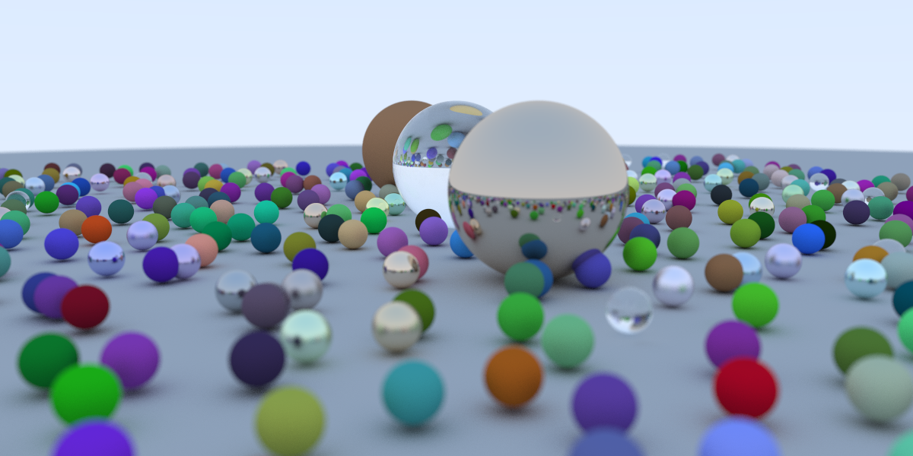

# CUDA Accelerated Ray Tracer

A CUDA implementation of **_Ray Tracing in One Weekend_** with per-pixel RNG, thin‑lens depth of field, metal/dielectric materials, and the randomized final scene. The code mirrors the book’s progression, adapted for GPU kernels and CUDA memory/launch patterns.

> References  
> • Peter Shirley, _Ray Tracing in One Weekend_ — https://raytracing.github.io/  
> • NVIDIA Developer Blog, “Accelerated Ray Tracing in One Weekend in CUDA” — https://developer.nvidia.com/blog/accelerated-ray-tracing-cuda/

---

## Table of Contents
- [Features](#features)
- [Requirements](#requirements)
- [Build & Run](#build--run)
  - [Quick start (Windows)](#quick-start-windows)
  - [Manual CMake build](#manual-cmake-build)
  - [Running & output](#running--output)
- [How it works (GPU notes)](#how-it-works-gpu-notes)
- [Tuning](#tuning)
- [Acknowledgements](#acknowledgements)

---

## Features

### Rendering pipeline
- **Antialiasing via stochastic supersampling** (per-pixel jitter using cuRAND)  
  <p align="left">
    
  </p>

- **Gamma correction** with configurable values
  <p align="left">
    
  </p>


### Materials
- **Metal** with **fuzz** parameter for rough/microfacet reflections  
- **Lambertian** (diffuse) with random cosine-ish scattering  
- **Dielectric** (glass): **refraction**, **total internal reflection**, and **Schlick** reflectance  
  <p align="left">
    
  </p>


### Camera
- **Thin‑lens defocus blur (depth of field)** (aperture + focus distance)
- Proper **camera basis** (`u/v/w`) with configurable FOV and aspect ratio
  <p align="left">
      
  </p>

---

## Requirements

- **Windows** with **Visual Studio 2022** (MSVC toolset)
- **CUDA Toolkit 12+** (13.x tested)
- **CMake 3.24+**
- NVIDIA GPU with supported **compute capability** (current flags target Ada 8.9; adjust for your GPU)

> If you target a different architecture, set `CMAKE_CUDA_ARCHITECTURES` (or `-gencode` in NVCC flags) appropriately in `CMakeLists.txt`.

---

## Build & Run

### Quick start (Windows)

A helper script automates clean, configure, build, and run. It will prompt for an output name and append `.ppm`:

```bat
setup.bat
```

### Manual CMake build

```bat
rmdir /s /q build
cmake -S . -B build
cmake --build build --config Debug
Build\bin\Debug
RayTracer.exe > output.ppm
```

### Running & output

- The renderer writes a **PPM (P3)** image to `stdout`.

- Run after building (Debug example):
  ```bat
  Build\bin\Debug
  rayTracer.exe > output.ppm
  ```

- Or use the helper script (prompts for a filename and appends `.ppm`):
  ```bat
  setup.bat
  ```

- View/convert the PPM:
  - **ImageMagick**: `magick convert output.ppm output.png`
  - **GIMP/Photoshop**: open `output.ppm` directly

> Scene parameters (resolution `nx/ny`, samples `ns`, camera, aperture, focus distance, and scene generator) live in `src/main.cu`.

---

## How it works (GPU notes)

- **Bounded depth instead of recursion**: the book’s recursive `color()` is turned into a loop (default max depth = 50) to avoid device stack overflows.
- **Per‑pixel RNG**: Each thread has a `curandState`. We copy the state to a local variable, sample multiple times, then write it back.
- **Unified memory for the framebuffer** (`cudaMallocManaged`) to simplify host readout (`stdout` → PPM).
- **Device-side scene build**: A small kernel constructs the world and camera once, then the main render kernel traces rays.
- **Thin‑lens DOF**: `random_in_unit_disk` samples the aperture; `lower_left_corner`, `horizontal`, and `vertical` are scaled by the **focus distance**; `lens_radius = aperture/2`.

---

## Tuning

- **Samples per pixel (spp)**: higher `ns` → cleaner images (time ∝ spp).
- **Resolution**: increase `nx/ny` for detail.
- **Max depth**: 50 is a good default; raising it gives diminishing returns.
- **Aperture**: small (`0.1`) = subtle blur; large (`2.0`) = strong DOF (needs more spp).
- **Build config**: use **Release** for speed; set `CMAKE_CUDA_ARCHITECTURES` to match your GPU.

---

## Acknowledgements

- Peter Shirley et al. for the **Ray Tracing in One Weekend** series.  
- NVIDIA Developer Blog for the CUDA adaptation guidance.

---
